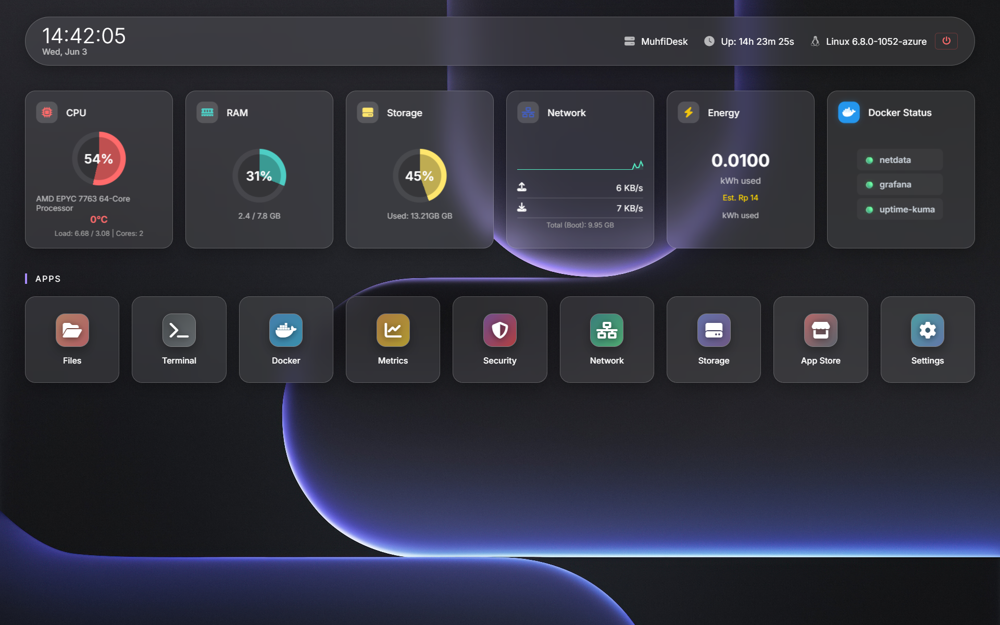

<div align="center">
  
  <h1>MuhfiDesk</h1>
  <p><strong>A Modern, Lightweight, and Beautiful Server Dashboard & App Store</strong></p>
  
  [](https://opensource.org/licenses/MIT)
  [](https://python.org)
  [](https://flask.palletsprojects.com/)
  [](#)
</div>

---

## 🌟 Overview

**MuhfiDesk** is a powerful and elegant server management dashboard designed to make managing your homelab or VPS as easy as a single click. Inspired by CasaOS, MuhfiDesk runs **bare-metal** on your system (no Docker required for the core dashboard), offering blazing-fast performance while still allowing you to deploy and manage hundreds of Dockerized applications through its built-in App Store.

> 

---

## ✨ Key Features

- 🚀 **1-Click App Store**: Instantly install hundreds of applications from the BigBearCasaOS repository.
- 📊 **Real-time Monitoring**: Beautiful charts for CPU, RAM, Disk, and Network usage via WebSocket.
- 🐳 **Docker Management**: View, start, stop, and configure running Docker containers seamlessly.
- 📁 **File Manager**: Fully functional web-based file explorer to manage your server data.
- 📟 **Web Terminal**: Root shell access directly from your browser.
- 🌓 **Modern UI/UX**: Dark mode, glassmorphism, responsive design, and smooth animations.
- 🛡️ **Secure**: Role-based access, audit logs, and Telegram notification alerts.

---

## ⚡ Quick Installation (1-Click)

MuhfiDesk can be installed on both Linux and Windows with a single command. The installer will automatically download the necessary dependencies, set up a virtual environment, and register MuhfiDesk as a background service.

### 🐧 Linux (Ubuntu / Debian / RHEL)

Open your terminal and run:

```bash
wget -qO- https://raw.githubusercontent.com/SatyaGanzz/MuhfiDesk/main/install.sh | sudo bash
```

### 🪟 Windows

Open **PowerShell as Administrator** and run:

```powershell
iwr -useb https://raw.githubusercontent.com/SatyaGanzz/MuhfiDesk/main/install.ps1 | iex
```

Once installed, simply open your web browser and navigate to:
**👉 http://localhost:5000** (or your server's IP address).

---

## 🛠️ Manual Installation (For Developers)

If you prefer to install MuhfiDesk manually or want to contribute to the project:

1. **Clone the repository:**

   ```bash
   git clone https://github.com/SatyaGanzz/MuhfiDesk.git
   cd MuhfiDesk
   ```

2. **Create a Python Virtual Environment:**

   ```bash
   python3 -m venv .venv
   source .venv/bin/activate  # On Windows: .venv\Scripts\activate
   ```

3. **Install Dependencies:**

   ```bash
   pip install -r requirements.txt
   ```

4. **Run the Dashboard:**
   ```bash
   python app.py
   ```

---

## 📸 Screenshots Gallery

<p align="center">
  
  
</p>

_(Replace these placeholders with actual screenshots of the App Store and Monitoring page by uploading your images to the repository and updating the links here)_

---

## 🤝 Contributing

Contributions, issues, and feature requests are welcome! Feel free to check the [issues page](https://github.com/SatyaGanzz/MuhfiDesk/issues) if you want to contribute.

## 📄 License

This project is licensed under the **MIT License**. See the `LICENSE` file for details.
